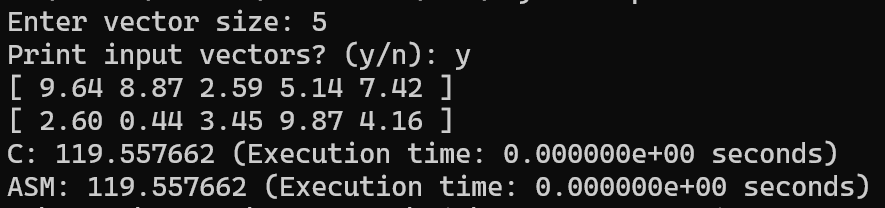

# LBYARCH MP2: x86-C Interfacing

- Diane Benedict S. Panganiban
- Lorenz Bernard B. Marqueses

**Input**: Scalar variable n (integer) contains the length of the vector;  Vectors $A$ and $B$ are both double-precision float. Scalar `sdot` is a double-precision float.

**Output**: store the result in memory location `sdot`.  Display the result for all versions of the kernel (i.e., C and  x86-64).

## Compiling

```
nasm -f win64 asm_dot_product.asm
gcc -c main.c -o main.obj -m64
gcc main.obj asm_dot_product.obj -o main.exe -m64
```

Alternatively, you may call the included `build.bat` file that runs the above for you:

```
build
```

## Runtime comparison

For two randomly-generated vectors of input size $n = 2^{28}$ ($n = 268,435,456$), the C implementation took approximately $6.903$ seconds, while the x86-64 implementation took approximately $0.412$ seconds. This difference is far less pronounced for smaller inputs, as `time.h`'s `clock()` function cannot measure the difference between the two execution times for $n = 5$, for instance (both end up being `0.0`).

## Screenshots

For $n = 5$:



For $n = 2^{28}$:


## Video

[Google Drive](https://drive.google.com/file/d/1uDxClVsX32PGd4l49SbWCMnRKk3aQsCn/view?usp=sharing)